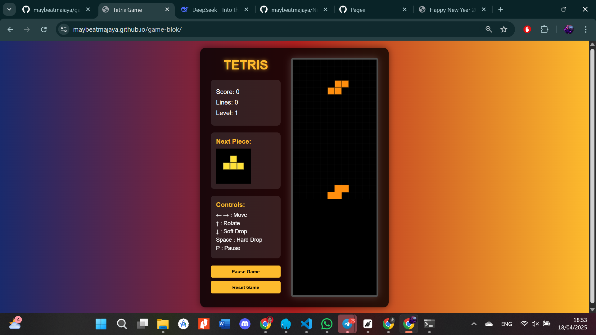

# 🎮 TETRIS GAME

 <!-- Ganti dengan screenshot aktual -->

## Tampilan Game Saat Dijalankan

### Layar Utama Game
- **Scoreboard**:
  - 🏆 `Score: 0` - Poin yang terkumpul
  - 📊 `Lines: 0` - Jumlah garis yang berhasil dihapus
  - 🚀 `Level: 1` - Tingkat kesulitan (naik setiap 10 garis)

- **Next Piece**:
  - Kotak preview yang menampilkan potongan berikutnya

- **Game Area**:
  - Grid 10x20 tempat potongan Tetris jatuh
  - Potongan berwarna-warni (I, J, L, O, S, T, Z)
  - Efek visual saat garis terhapus

### Kontrol Game
| Tombol | Aksi |
|--------|------|
| ← → | Gerakan kiri/kanan |
| ↑ | Rotasi potongan |
| ↓ | Soft drop (jatuh lebih cepat) |
| Space | Hard drop (jatuh langsung ke bawah) |
| P | Pause/menjeda game |

### Menu Aksi
- **Pass Game**: [Fitur khusus jika ada]
- **Reset Game**: Memulai permainan baru

## Cara Memainkan
1. Akses game online di: [GitHub Pages Link]
2. Atau clone repository dan buka `index.html` di browser
